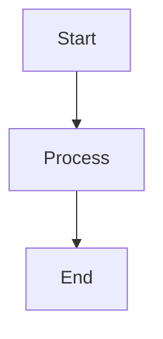

# Overload Documentation

This directory contains the documentation website for the Overload project, built with [Docusaurus](https://docusaurus.io/) v3.8.

## Features

- **Mermaid Diagrams**: Support for creating flowcharts, sequence diagrams, and other visualizations
- **Dark Mode**: Toggle between light and dark themes
- **TypeScript**: Full TypeScript support
- **Responsive Design**: Works on all device sizes
- **Search**: Built-in search functionality

## Getting Started

### From the main project directory:

```bash
# Start the documentation development server
npm run docs:start

# Build the documentation for production
npm run docs:build

# Serve the built documentation locally
npm run docs:serve
```

### From the docs directory:

```bash
# Install dependencies (first time only)
npm install

# Start development server
npm start

# Build for production
npm run build

# Serve built site locally
npm run serve
```

## Creating Mermaid Diagrams

You can create Mermaid diagrams in any Markdown file using fenced code blocks:

````markdown

````

### Supported Diagram Types

- **Flowcharts**: `graph TD`, `graph LR`
- **Sequence Diagrams**: `sequenceDiagram`
- **Class Diagrams**: `classDiagram`
- **State Diagrams**: `stateDiagram`
- **Entity Relationship**: `erDiagram`
- **User Journey**: `journey`
- **Gantt Charts**: `gantt`
- **Pie Charts**: `pie`
- **Git Graphs**: `gitgraph`

For more information on Mermaid syntax, visit: https://mermaid.js.org/

## Project Structure

```
docs/
├── docs/           # Documentation pages
├── blog/           # Blog posts
├── src/            # React components and pages
├── static/         # Static assets
└── docusaurus.config.ts  # Configuration file
```

## Adding New Documentation

1. Create new `.md` files in the `docs/` folder
2. Add them to `sidebars.ts` for navigation
3. Use Mermaid diagrams to visualize complex concepts
4. Test locally with `npm start`

## Deployment

The documentation can be deployed to various platforms:

- **GitHub Pages**: Configure in `docusaurus.config.ts`
- **Netlify**: Deploy the `build/` folder
- **Vercel**: Connect your repository
- **Self-hosted**: Use the built files from `npm run build`

For more details, see: https://docusaurus.io/docs/deployment
