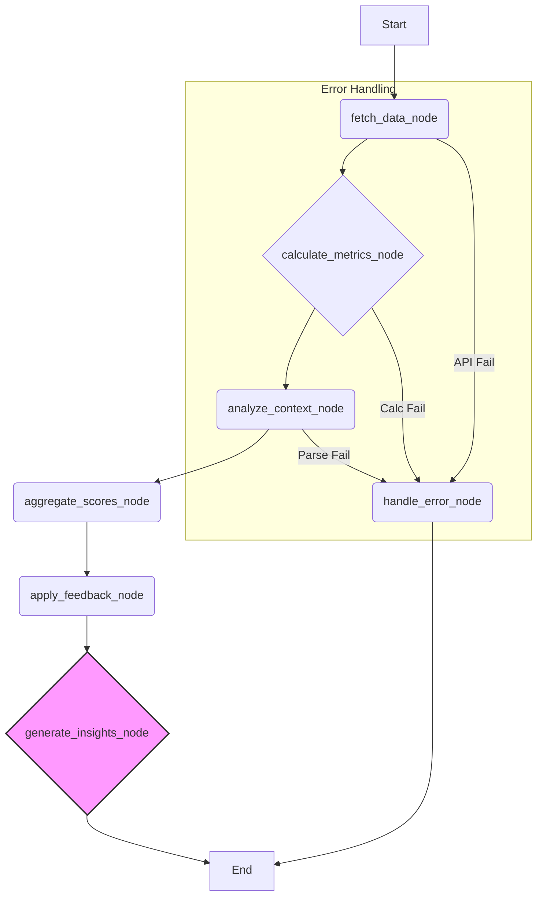

# AI Workflow Architecture

This document provides the detailed technical specification for the LangGraph-powered workflow that calculates the Overload Index (θ). It is the technical companion to the narrative found in the [BrainLift document](./brain-lift-1.md).

## 1. Graph State Definition

The entire workflow operates on a persistent state object. This object is passed between nodes, with each node enriching or transforming the data within it. The state is defined by the following TypeScript interface:

```typescript
interface MotionTask {
  id: string;
  name: string;
  projectId: string;
  dueDate: string | null;
  duration: number; // in minutes
  description: string;
}

interface OverloadMetrics {
  taskDensity: number;      // 0-1 scale
  meetingLoad: number;      // 0-1 scale
  deadlinePressure: number; // 0-1 scale
  contextSwitching: number; // 0-1 scale
}

interface GraphState {
  tasks: MotionTask[];
  meetings: any[]; // Define meeting structure as needed
  userFeedback: { score: number; timestamp: Date } | null;
  
  // Calculated values
  metrics: OverloadMetrics | null;
  weightedIndex: number;
  finalIndex: number;
  
  // Final output
  recommendations: string[];
  error: string | null;
}
```

## 2. Workflow Graph

The following diagram illustrates the nodes and edges of the LangGraph workflow. Each node represents a distinct function or processing step.



## 3. Node-by-Node Breakdown

### `fetch_data_node`
-   **Purpose**: To retrieve the raw data needed for the calculation.
-   **Inputs**: Trigger event (e.g., from a scheduler or manual sync).
-   **Process**:
    1.  Calls the `MotionAPIService` to fetch tasks and calendar events for the relevant time window (e.g., today + next 2 days).
    2.  Handles basic data validation and sanitization.
-   **Outputs**: Populates `state.tasks` and `state.meetings`. On failure, it populates `state.error` and transitions to `handle_error_node`.

### `calculate_metrics_node`
-   **Purpose**: To perform initial, objective calculations on the raw data.
-   **Inputs**: `state.tasks`, `state.meetings`.
-   **Process**:
    1.  **Task Density**: Calculates the total number of tasks.
    2.  **Meeting Load**: Calculates the total duration of scheduled meetings.
    3.  **Deadline Pressure**: Calculates a score based on how many tasks are due soon.
-   **Outputs**: Populates the `taskDensity`, `meetingLoad`, and `deadlinePressure` fields in `state.metrics`.

### `analyze_context_node`
-   **Purpose**: To extract qualitative, contextual information that isn't immediately obvious from the raw numbers. This is a key "intelligence" step.
-   **Inputs**: `state.tasks`.
-   **Process**:
    1.  Iterates through task descriptions to parse for metadata (e.g., `#urgent`, `effort:high`).
    2.  Calculates a **Context Switching** score by analyzing the diversity of `projectId` values within a short time frame. A day with tasks from 5 different projects has a higher score than a day with tasks from just one.
-   **Outputs**: Populates the `contextSwitching` field in `state.metrics`.

### `aggregate_scores_node`
-   **Purpose**: To combine all the calculated metrics into a preliminary score.
-   **Inputs**: `state.metrics`.
-   **Process**:
    1.  Applies a set of weights to each metric (e.g., `deadlinePressure` might have a higher weight than `taskDensity`).
    2.  Sums the weighted scores to produce a single number.
-   **Outputs**: Populates `state.weightedIndex`.

### `apply_feedback_node`
-   **Purpose**: To personalize the Overload Index based on the user's subjective feedback. This creates the learning loop.
-   **Inputs**: `state.weightedIndex`, `state.userFeedback`.
-   **Process**:
    1.  Retrieves the user's historical feedback from local storage.
    2.  If recent, relevant feedback exists (e.g., user felt overloaded at a score of 70), it applies a modifier to the `weightedIndex`. For example, it might increase the final score by 10% to better reflect the user's sensitivity.
    3.  The logic here also updates the weights used in the `aggregate_scores_node` for future runs, allowing the system to adapt over time.
-   **Outputs**: Populates `state.finalIndex`.

### `generate_insights_node`
-   **Purpose**: To provide a simple, human-readable explanation for the current score.
-   **Inputs**: `state.finalIndex`, `state.metrics`.
-   **Process**:
    1.  Identifies the top 1-2 metrics contributing to the score.
    2.  Uses a simple template or a small LLM call to generate a recommendation.
        -   *Example*: If `contextSwitching` is high, the output might be: "Your load is high due to frequent context switching. Try to group similar tasks together."
-   **Outputs**: Populates `state.recommendations`.

### `handle_error_node`
-   **Purpose**: A terminal node to gracefully handle any failures in the workflow.
-   **Process**: Logs the error from `state.error` and ensures the application doesn't crash, potentially showing a "failed to sync" message in the UI. 