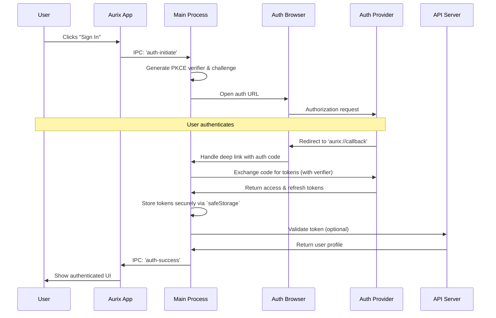

# Authentication Flow

## Overview

Aurix follows a **local-first, authentication-optional** model. Users can use all core features of the application immediately without signing up. Authentication is only required for optional cloud features like multi-device sync and backups.

## Authentication States

### 1. Anonymous Mode (Default)
- Full access to core features.
- Local voice recording and transcription.
- Local AI processing via Ollama.
- Local document generation and export.
- All data stored locally in a private SQLite database.

### 2. Authenticated Mode (Optional)
- Everything in Anonymous Mode, plus:
- End-to-end encrypted multi-device synchronization.
- Secure cloud backup and restore.
- Access to optional cloud-based AI models (with user-provided keys).

## OAuth 2.0 with PKCE

For a desktop application, the **Proof Key for Code Exchange (PKCE)** OAuth flow is the industry standard for security.

- **Why PKCE?** It's designed for applications that cannot securely store a client secret. It protects against authorization code interception attacks, making it ideal for our distributed desktop environment.
- **Provider**: We will use a provider like **Auth0** to handle the complexities of authentication, supporting standard email/password logins as well as social logins (Google, GitHub, etc.).

## Authentication Sequence

## User Experience

The authentication flow is designed to be unobtrusive.

### First Launch (Anonymous)
1.  The user opens Aurix and can immediately start using it.
2.  No sign-up walls or mandatory login screens.
3.  Core features like voice capture and local document generation are fully available.

### Opting-in to Cloud Sync
1.  The user navigates to Settings and clicks "Enable Cloud Sync".
2.  A modal appears explaining the benefits (backup, multi-device sync) and privacy implications (end-to-end encryption).
3.  The user clicks "Sign In & Enable Sync".
4.  The secure browser-based authentication flow (diagrammed above) is initiated.
5.  Upon success, the app automatically begins its initial sync in the background.

## Security & Implementation Notes

-   **Token Storage**: Tokens will be stored exclusively in the main process, using Electron's `safeStorage` API to encrypt them with OS-native credentials (e.g., Keychain on macOS). The renderer process will never have direct access to tokens.
-   **Deep Linking**: A custom protocol (e.g., `aurix://`) will be registered to handle the OAuth callback securely, passing the authorization code directly to the main process.
-   **Session Management**: The main process will be responsible for silently refreshing access tokens in the background using the stored refresh token, ensuring the user remains logged in seamlessly. 