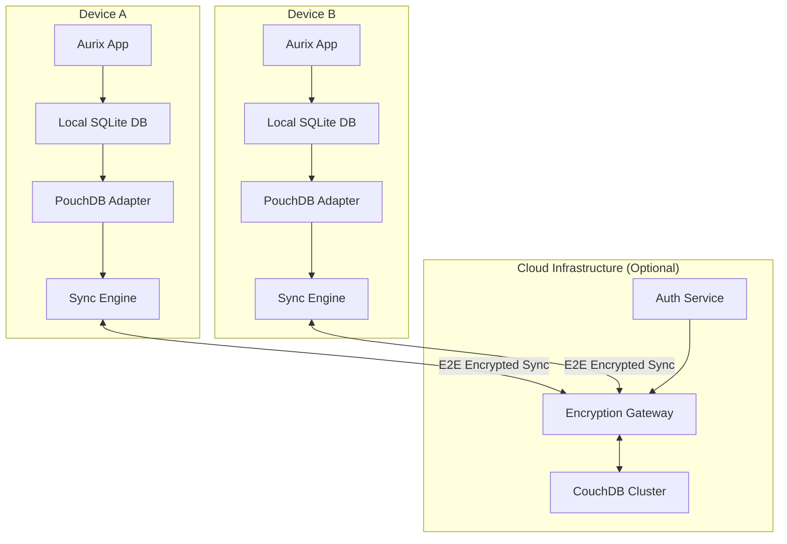

# Data Sync Architecture

## Overview

For users who choose to enable cloud features, Aurix implements an **offline-first, conflict-free** synchronization architecture. This ensures users can work seamlessly across multiple devices, with all data remaining private and secure through end-to-end encryption.

## Core Principles

1.  **Offline-First**: The application is fully functional without an internet connection.
2.  **Privacy-First**: All sensitive data is end-to-end encrypted. The server never sees unencrypted user content.
3.  **Conflict-Free**: The system uses automatic conflict resolution strategies to prevent data loss when changes are made on multiple devices simultaneously.
4.  **Real-Time**: When online, changes propagate to other devices immediately.
5.  **Opt-In**: Synchronization is an optional feature that the user must explicitly enable after authenticating.

## Architecture Diagram

## How It Works

1.  **Local Storage**: All data (voice recordings, transcripts, generated documents) is first saved to the local SQLite database. This is the source of truth for the application in its default, offline state.
2.  **Sync Layer**: When sync is enabled, a PouchDB adapter mirrors the relevant local data. PouchDB is a JavaScript database that is excellent at synchronization.
3.  **Encryption**: Before any data leaves the device, it is encrypted using keys derived from the user's password. The unencrypted data and the keys never leave the user's machine.
4.  **Cloud Sync**: The encrypted data is then synced with a CouchDB instance in the cloud. CouchDB's replication protocol is designed to handle conflicts and ensure data consistency across all connected devices.
5.  **Conflict Resolution**: If a user modifies the same document on two different devices while offline, CouchDB's versioning system will detect the conflict when they come back online. The Sync Engine on the device will then apply a "last write wins" or a more sophisticated merge strategy to resolve the conflict without data loss.

This architecture ensures that Aurix provides the convenience of cloud sync without compromising the privacy and security of a local-first application. 