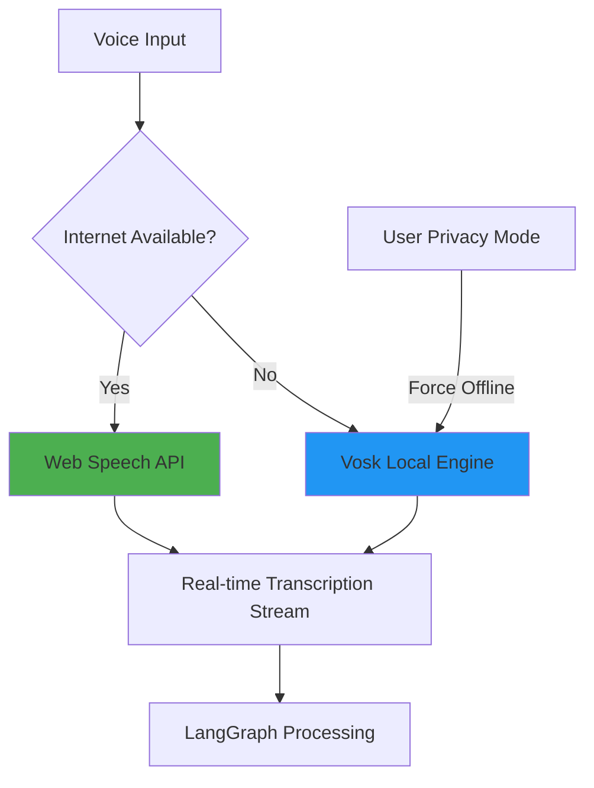

# Voice Implementation Architecture

## Overview: A Hybrid Approach

Aurix's voice system is built on a hybrid architecture to provide a seamless, low-latency, and reliable transcription experience under any network condition. This approach ensures the best possible user experience by combining the strengths of both cloud-based and local speech recognition engines.

-   **Online Mode (Default)**: When an internet connection is available, Aurix uses the **Web Speech API** built into modern Chromium browsers. This provides high-accuracy, real-time streaming transcription with minimal local resource usage.
-   **Offline Mode (Automatic Fallback)**: If the user is offline, or if they enable "Privacy Mode," Aurix automatically switches to a local **Vosk** engine. This ensures the application remains fully functional without an internet connection, keeping all voice data entirely on the user's machine.

## Architecture & Implementation

### 1. Hybrid Transcription Service (Main Process)
The core of this system is a `HybridTranscriptionService` that lives in the Electron main process. Its responsibilities include:
-   **Connectivity Monitoring**: Regularly checks for an active internet connection.
-   **Mode Switching**: Seamlessly transitions between Web Speech API and Vosk based on connectivity or user preference.
-   **Vosk Initialization**: Manages the local Vosk model, including downloading it on first use.
-   **Centralized Events**: Emits a consistent stream of transcription events to the rest of the application, regardless of the underlying source.

### 2. Web Speech API Handler (Renderer Process)
-   Because the Web Speech API is a browser API, it must be run from the renderer process.
-   A handler in the renderer will listen for IPC commands from the main process to start or stop recognition.
-   As the Web Speech API produces results, the handler will immediately forward them back to the `HybridTranscriptionService` in the main process via IPC.

### 3. Vosk Engine (Main Process)
-   The Vosk recognizer and its language models are managed entirely within the main process.
-   Raw audio data from the capture pipeline is piped directly to the Vosk recognizer.
-   Vosk's streaming recognition capabilities provide partial and final results, which are then formatted into the same event structure as the Web Speech API results.

### 4. Audio Processing Pipeline
The initial audio capture remains the same:
-   The **Web Audio API** captures 16kHz mono audio.
-   An **AudioWorklet** processes the audio in a separate thread to prevent UI blocking.
-   The processed audio chunks are sent to the main process via IPC.
-   The `HybridTranscriptionService` then routes these audio chunks to the active engine (Vosk) or signals the renderer to continue its own processing (Web Speech).

This hybrid architecture ensures that Aurix [[memory:911348]] is always responsive and functional, providing a superior user experience while respecting user privacy. 