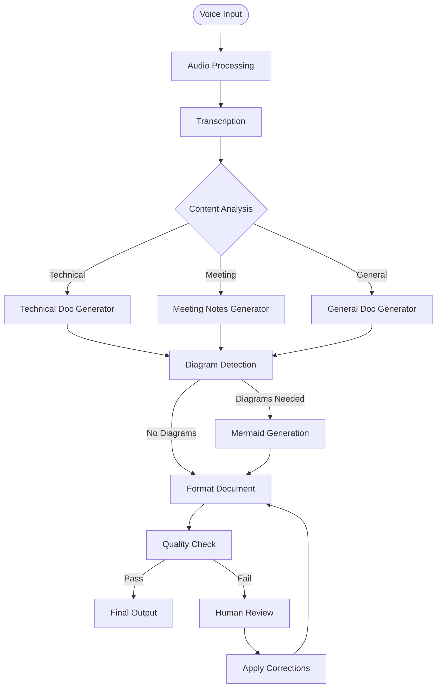

# Aurix - LangGraph Workflow Specifications

## Overview

LangGraph orchestrates Aurix's core voice-to-documentation pipeline through a sophisticated state machine that transforms raw audio into structured documents with diagrams. This document specifies the complete workflow architecture, from initial voice capture to final document generation.

## Core Workflow Architecture

### Why LangGraph?

LangGraph provides several critical capabilities for Aurix:
- **Stateful Workflows**: Maintains context across long documentation sessions
- **Streaming Support**: Real-time UI updates as documents generate
- **Error Recovery**: Graceful handling of transcription/AI failures
- **Conditional Logic**: Dynamic routing based on content type
- **Human-in-the-Loop**: User can intervene and guide the process
- **Checkpointing**: Resume interrupted documentation sessions

### High-Level Workflow



## State Definition

### Core State Schema

```typescript
// types/workflow.ts
interface DocumentationState {
  // Input data
  sessionId: string;
  audioBuffer: ArrayBuffer | null;
  audioUrl: string | null;
  
  // Transcription results
  rawTranscript: string;
  segments: TranscriptSegment[];
  language: string;
  confidence: number;
  
  // Content analysis
  documentType: 'technical' | 'meeting' | 'general' | 'unknown';
  topics: string[];
  entities: Entity[];
  intent: DocumentIntent;
  
  // Generated content
  outline: DocumentOutline;
  sections: DocumentSection[];
  diagrams: DiagramSpec[];
  metadata: DocumentMetadata;
  
  // Output
  markdownContent: string;
  mermaidDiagrams: MermaidDiagram[];
  finalDocument: string;
  
  // Workflow control
  errors: WorkflowError[];
  warnings: string[];
  humanFeedback: HumanFeedback[];
  checkpoints: Checkpoint[];
  streaming: StreamingState;
}

interface TranscriptSegment {
  text: string;
  start: number;
  end: number;
  confidence: number;
  speaker?: string;
}

interface DiagramSpec {
  type: 'flowchart' | 'sequence' | 'classDiagram' | 'stateDiagram' | 'er' | 'gantt';
  title: string;
  description: string;
  entities: string[];
  relationships: string[];
}

interface StreamingState {
  currentNode: string;
  progress: number;
  partialResults: any;
}
```

## Node Specifications

### 1. Audio Processing Node

**Purpose**: Prepare audio for transcription
**Input**: Raw audio buffer or file path
**Output**: Normalized audio ready for Whisper

```typescript
// nodes/audioProcessing.ts
export async function audioProcessingNode(state: DocumentationState): Promise<Partial<DocumentationState>> {
  try {
    let audioBuffer = state.audioBuffer;
    
    // Load audio if URL provided
    if (!audioBuffer && state.audioUrl) {
      audioBuffer = await loadAudioFile(state.audioUrl);
    }
    
    // Validate audio format
    const audioInfo = await getAudioInfo(audioBuffer);
    if (audioInfo.sampleRate !== 16000) {
      audioBuffer = await resampleAudio(audioBuffer, 16000);
    }
    
    // Normalize audio levels
    audioBuffer = await normalizeAudio(audioBuffer);
    
    // Detect voice activity
    const vad = await detectVoiceActivity(audioBuffer);
    if (vad.speechRatio < 0.1) {
      throw new Error('No speech detected in audio');
    }
    
    return {
      audioBuffer,
      streaming: {
        currentNode: 'audioProcessing',
        progress: 100,
        partialResults: { duration: audioInfo.duration }
      }
    };
  } catch (error) {
    return {
      errors: [...state.errors, { node: 'audioProcessing', error: error.message }]
    };
  }
}
```

### 2. Transcription Node

**Purpose**: Convert audio to text using Whisper
**Input**: Processed audio buffer
**Output**: Transcript with segments and metadata

```typescript
// nodes/transcription.ts
import { WhisperModel } from '../services/whisper';

export async function transcriptionNode(state: DocumentationState): Promise<Partial<DocumentationState>> {
  const whisper = WhisperModel.getInstance();
  
  // Stream transcription progress
  const onProgress = (progress: number) => {
    state.streaming = {
      currentNode: 'transcription',
      progress,
      partialResults: null
    };
  };
  
  try {
    const result = await whisper.transcribe(state.audioBuffer, {
      language: 'auto',
      task: 'transcribe',
      outputSegments: true,
      onProgress
    });
    
    return {
      rawTranscript: result.text,
      segments: result.segments.map(seg => ({
        text: seg.text,
        start: seg.start,
        end: seg.end,
        confidence: seg.confidence
      })),
      language: result.language,
      confidence: result.confidence,
      streaming: {
        currentNode: 'transcription',
        progress: 100,
        partialResults: { wordCount: result.text.split(' ').length }
      }
    };
  } catch (error) {
    // Fallback to cloud transcription if local fails
    if (state.userPreferences?.allowCloudFallback) {
      return await cloudTranscriptionFallback(state);
    }
    throw error;
  }
}
```

### 3. Content Analysis Node

**Purpose**: Understand the content type and structure
**Input**: Raw transcript
**Output**: Document type, topics, entities, and intent

```typescript
// nodes/contentAnalysis.ts
export async function contentAnalysisNode(state: DocumentationState): Promise<Partial<DocumentationState>> {
  const analyzer = new ContentAnalyzer();
  
  // Detect document type
  const documentType = await analyzer.classifyDocumentType(state.rawTranscript);
  
  // Extract topics using NLP
  const topics = await analyzer.extractTopics(state.rawTranscript);
  
  // Named entity recognition
  const entities = await analyzer.extractEntities(state.rawTranscript);
  
  // Determine user intent
  const intent = await analyzer.determineIntent(state.rawTranscript, {
    segments: state.segments,
    previousDocuments: state.sessionHistory
  });
  
  // Detect if diagrams are mentioned
  const diagramHints = analyzer.detectDiagramHints(state.rawTranscript);
  
  return {
    documentType,
    topics,
    entities,
    intent,
    diagrams: diagramHints.map(hint => ({
      type: hint.type,
      title: hint.suggestedTitle,
      description: hint.context,
      entities: hint.mentionedEntities,
      relationships: hint.relationships
    })),
    streaming: {
      currentNode: 'contentAnalysis',
      progress: 100,
      partialResults: { topicCount: topics.length }
    }
  };
}
```

### 4. Document Generation Node (Technical)

**Purpose**: Generate technical documentation
**Input**: Analyzed content
**Output**: Structured sections with code blocks

```typescript
// nodes/technicalDocGenerator.ts
export async function technicalDocGeneratorNode(state: DocumentationState): Promise<Partial<DocumentationState>> {
  const llm = await getLLM(state.userPreferences);
  
  // Generate outline first
  const outline = await llm.invoke({
    messages: [
      SystemMessage({
        content: TECHNICAL_DOC_SYSTEM_PROMPT
      }),
      HumanMessage({
        content: `Create a technical documentation outline for: ${state.rawTranscript}`
      })
    ],
    stream: true,
    onToken: (token) => {
      state.streaming = {
        currentNode: 'technicalDocGenerator',
        progress: 25,
        partialResults: { outline: token }
      };
    }
  });
  
  // Generate sections in parallel
  const sections = await Promise.all(
    outline.sections.map(async (section, index) => {
      const sectionContent = await generateSection(llm, {
        transcript: state.rawTranscript,
        section: section,
        entities: state.entities,
        previousSections: sections.slice(0, index)
      });
      
      state.streaming = {
        currentNode: 'technicalDocGenerator',
        progress: 25 + (50 * (index + 1) / outline.sections.length),
        partialResults: { completedSections: index + 1 }
      };
      
      return sectionContent;
    })
  );
  
  // Add code examples if mentioned
  const enrichedSections = await enrichWithCodeExamples(sections, state);
  
  return {
    outline,
    sections: enrichedSections,
    streaming: {
      currentNode: 'technicalDocGenerator',
      progress: 100,
      partialResults: { sectionCount: sections.length }
    }
  };
}
```

### 5. Diagram Generation Node

**Purpose**: Create Mermaid diagrams from descriptions
**Input**: Diagram specifications
**Output**: Valid Mermaid syntax

```typescript
// nodes/diagramGenerator.ts
export async function diagramGeneratorNode(state: DocumentationState): Promise<Partial<DocumentationState>> {
  if (!state.diagrams || state.diagrams.length === 0) {
    return {}; // No diagrams needed
  }
  
  const llm = await getLLM(state.userPreferences);
  const mermaidDiagrams: MermaidDiagram[] = [];
  
  for (const [index, spec] of state.diagrams.entries()) {
    const mermaidCode = await generateMermaidDiagram(llm, spec);
    
    // Validate Mermaid syntax
    const validation = await validateMermaidSyntax(mermaidCode);
    if (!validation.isValid) {
      // Attempt to fix syntax errors
      const fixed = await fixMermaidSyntax(llm, mermaidCode, validation.errors);
      mermaidCode = fixed;
    }
    
    // Generate SVG preview
    const svg = await renderMermaidToSVG(mermaidCode);
    
    mermaidDiagrams.push({
      id: `diagram-${index}`,
      type: spec.type,
      title: spec.title,
      mermaidCode,
      svg,
      spec
    });
    
    state.streaming = {
      currentNode: 'diagramGenerator',
      progress: (index + 1) / state.diagrams.length * 100,
      partialResults: { diagramsCompleted: index + 1 }
    };
  }
  
  return { mermaidDiagrams };
}

async function generateMermaidDiagram(llm: LLM, spec: DiagramSpec): Promise<string> {
  const prompt = `Generate a ${spec.type} diagram in Mermaid syntax.
Title: ${spec.title}
Description: ${spec.description}
Entities: ${spec.entities.join(', ')}
Relationships: ${spec.relationships.join(', ')}

Rules:
- Use proper Mermaid syntax
- Keep labels concise
- Use appropriate arrow types
- Include all specified entities`;

  const response = await llm.invoke({
    messages: [
      SystemMessage({ content: MERMAID_GENERATION_PROMPT }),
      HumanMessage({ content: prompt })
    ]
  });
  
  return extractMermaidCode(response.content);
}
```

### 6. Document Assembly Node

**Purpose**: Combine all parts into final document
**Input**: Sections and diagrams
**Output**: Complete markdown document

```typescript
// nodes/documentAssembly.ts
export async function documentAssemblyNode(state: DocumentationState): Promise<Partial<DocumentationState>> {
  const assembler = new DocumentAssembler();
  
  // Create frontmatter
  const frontmatter = assembler.createFrontmatter({
    title: state.outline.title,
    date: new Date(),
    topics: state.topics,
    type: state.documentType,
    language: state.language
  });
  
  // Assemble sections with diagrams
  let markdown = frontmatter + '\n\n';
  
  for (const section of state.sections) {
    markdown += `## ${section.title}\n\n`;
    markdown += section.content + '\n\n';
    
    // Insert relevant diagrams
    const relevantDiagrams = findRelevantDiagrams(section, state.mermaidDiagrams);
    for (const diagram of relevantDiagrams) {
      markdown += `### ${diagram.title}\n\n`;
      markdown += '```mermaid\n';
      markdown += diagram.mermaidCode;
      markdown += '\n```\n\n';
    }
  }
  
  // Add metadata footer
  markdown += assembler.createFooter({
    transcriptionConfidence: state.confidence,
    generationModel: state.userPreferences?.model || 'local',
    sessionId: state.sessionId
  });
  
  return {
    markdownContent: markdown,
    finalDocument: markdown,
    streaming: {
      currentNode: 'documentAssembly',
      progress: 100,
      partialResults: { documentLength: markdown.length }
    }
  };
}
```

### 7. Quality Check Node

**Purpose**: Validate document quality
**Input**: Final document
**Output**: Quality score and issues

```typescript
// nodes/qualityCheck.ts
export async function qualityCheckNode(state: DocumentationState): Promise<Partial<DocumentationState>> {
  const checker = new QualityChecker();
  
  const issues: QualityIssue[] = [];
  
  // Check document completeness
  const completeness = checker.checkCompleteness(state.finalDocument, {
    expectedSections: state.outline.sections,
    requiredElements: getRequiredElements(state.documentType)
  });
  
  if (completeness.score < 0.8) {
    issues.push({
      type: 'incomplete',
      severity: 'high',
      message: `Document missing: ${completeness.missing.join(', ')}`
    });
  }
  
  // Check diagram validity
  for (const diagram of state.mermaidDiagrams) {
    const validation = await validateMermaidSyntax(diagram.mermaidCode);
    if (!validation.isValid) {
      issues.push({
        type: 'invalid-diagram',
        severity: 'medium',
        message: `Diagram "${diagram.title}" has syntax errors`,
        details: validation.errors
      });
    }
  }
  
  // Check for consistency
  const consistency = checker.checkConsistency(state.finalDocument, {
    entities: state.entities,
    terminology: state.projectGlossary
  });
  
  issues.push(...consistency.issues);
  
  // Calculate overall quality score
  const qualityScore = calculateQualityScore(issues);
  
  if (qualityScore < 0.7 || issues.some(i => i.severity === 'high')) {
    return {
      errors: [...state.errors, {
        node: 'qualityCheck',
        error: 'Document quality below threshold',
        details: issues
      }],
      warnings: issues.filter(i => i.severity === 'low').map(i => i.message)
    };
  }
  
  return {
    metadata: {
      ...state.metadata,
      qualityScore,
      qualityIssues: issues
    }
  };
}
```

## Conditional Routing

### Document Type Router

```typescript
// routers/documentTypeRouter.ts
export function documentTypeRouter(state: DocumentationState): string {
  switch (state.documentType) {
    case 'technical':
      return 'technicalDocGenerator';
    case 'meeting':
      return 'meetingNotesGenerator';
    case 'general':
      return 'generalDocGenerator';
    default:
      // Ask user for clarification
      return 'clarificationNode';
  }
}
```

### Error Recovery Router

```typescript
// routers/errorRouter.ts
export function errorRouter(state: DocumentationState): string {
  const lastError = state.errors[state.errors.length - 1];
  
  if (!lastError) return END;
  
  switch (lastError.node) {
    case 'transcription':
      if (state.retryCount < 3) {
        return 'transcription'; // Retry
      }
      return 'manualTranscriptionNode'; // Fallback
      
    case 'diagramGenerator':
      return 'skipDiagramsNode'; // Continue without diagrams
      
    case 'qualityCheck':
      return 'humanReviewNode'; // Request human input
      
    default:
      return 'errorHandlerNode';
  }
}
```

## Human-in-the-Loop Integration

### Human Review Node

```typescript
// nodes/humanReview.ts
export async function humanReviewNode(state: DocumentationState): Promise<Partial<DocumentationState>> {
  // Send document to renderer for review
  const reviewRequest: ReviewRequest = {
    document: state.finalDocument,
    issues: state.metadata.qualityIssues,
    suggestions: generateSuggestions(state)
  };
  
  // Wait for human feedback
  const feedback = await requestHumanReview(reviewRequest);
  
  if (feedback.action === 'approve') {
    return {
      humanFeedback: [...state.humanFeedback, feedback],
      finalDocument: feedback.editedDocument || state.finalDocument
    };
  }
  
  if (feedback.action === 'regenerate') {
    // Reset workflow with additional context
    return {
      rawTranscript: state.rawTranscript + '\n\n' + feedback.additionalContext,
      humanFeedback: [...state.humanFeedback, feedback],
      // Clear generated content to restart
      sections: [],
      diagrams: [],
      finalDocument: ''
    };
  }
  
  // Apply specific edits
  return {
    humanFeedback: [...state.humanFeedback, feedback],
    sections: applyEditsToSections(state.sections, feedback.edits),
    // Trigger reassembly
    finalDocument: ''
  };
}
```

## Streaming and Real-time Updates

### Streaming Configuration

```typescript
// config/streaming.ts
export const STREAMING_CONFIG = {
  updateInterval: 100, // ms
  chunkSize: 50, // characters
  enablePartialResults: true,
  streamNodes: [
    'transcription',
    'technicalDocGenerator',
    'diagramGenerator'
  ]
};
```

### Streaming Implementation

```typescript
// services/streamingManager.ts
export class StreamingManager {
  private subscribers: Map<string, StreamSubscriber[]> = new Map();
  
  async streamToRenderer(state: DocumentationState) {
    const channel = `session-${state.sessionId}`;
    
    // Send update to all subscribers
    this.subscribers.get(channel)?.forEach(subscriber => {
      subscriber.send({
        type: 'progress',
        node: state.streaming.currentNode,
        progress: state.streaming.progress,
        partial: state.streaming.partialResults
      });
    });
  }
  
  subscribeToSession(sessionId: string, callback: StreamSubscriber) {
    const channel = `session-${sessionId}`;
    if (!this.subscribers.has(channel)) {
      this.subscribers.set(channel, []);
    }
    this.subscribers.get(channel).push(callback);
  }
}
```

## Complete Workflow Definition

```typescript
// workflows/documentationWorkflow.ts
import { StateGraph, END } from '@langchain/langgraph';

export function createDocumentationWorkflow() {
  const workflow = new StateGraph<DocumentationState>({
    channels: documentationStateChannels
  });
  
  // Add all nodes
  workflow.addNode('audioProcessing', audioProcessingNode);
  workflow.addNode('transcription', transcriptionNode);
  workflow.addNode('contentAnalysis', contentAnalysisNode);
  workflow.addNode('technicalDocGenerator', technicalDocGeneratorNode);
  workflow.addNode('meetingNotesGenerator', meetingNotesGeneratorNode);
  workflow.addNode('generalDocGenerator', generalDocGeneratorNode);
  workflow.addNode('diagramGenerator', diagramGeneratorNode);
  workflow.addNode('documentAssembly', documentAssemblyNode);
  workflow.addNode('qualityCheck', qualityCheckNode);
  workflow.addNode('humanReview', humanReviewNode);
  
  // Define edges
  workflow.setEntryPoint('audioProcessing');
  workflow.addEdge('audioProcessing', 'transcription');
  workflow.addEdge('transcription', 'contentAnalysis');
  
  // Conditional routing based on document type
  workflow.addConditionalEdges(
    'contentAnalysis',
    documentTypeRouter,
    {
      'technicalDocGenerator': 'technicalDocGenerator',
      'meetingNotesGenerator': 'meetingNotesGenerator',
      'generalDocGenerator': 'generalDocGenerator',
      'clarificationNode': 'clarificationNode'
    }
  );
  
  // All generators lead to diagram generation
  workflow.addEdge('technicalDocGenerator', 'diagramGenerator');
  workflow.addEdge('meetingNotesGenerator', 'diagramGenerator');
  workflow.addEdge('generalDocGenerator', 'diagramGenerator');
  
  // Assembly and quality check
  workflow.addEdge('diagramGenerator', 'documentAssembly');
  workflow.addEdge('documentAssembly', 'qualityCheck');
  
  // Quality check routing
  workflow.addConditionalEdges(
    'qualityCheck',
    (state) => state.errors.length > 0 ? 'humanReview' : END,
    {
      'humanReview': 'humanReview',
      [END]: END
    }
  );
  
  // Human review can loop back
  workflow.addConditionalEdges(
    'humanReview',
    (state) => {
      const lastFeedback = state.humanFeedback[state.humanFeedback.length - 1];
      if (lastFeedback?.action === 'regenerate') {
        return 'contentAnalysis';
      }
      return 'documentAssembly';
    }
  );
  
  return workflow.compile({
    checkpointer: createSQLiteCheckpointer(),
    interruptBefore: ['humanReview'],
    debug: process.env.NODE_ENV === 'development'
  });
}
```

## Integration with Electron

### Main Process Integration

```typescript
// main/services/workflowService.ts
import { createDocumentationWorkflow } from '../workflows/documentationWorkflow';

export class WorkflowService {
  private workflow: CompiledGraph;
  private sessions: Map<string, WorkflowSession> = new Map();
  
  constructor() {
    this.workflow = createDocumentationWorkflow();
  }
  
  async startSession(audioPath: string): Promise<string> {
    const sessionId = generateSessionId();
    const session = {
      id: sessionId,
      startedAt: Date.now(),
      state: {
        sessionId,
        audioUrl: audioPath,
        errors: [],
        warnings: [],
        humanFeedback: [],
        checkpoints: []
      }
    };
    
    this.sessions.set(sessionId, session);
    
    // Start workflow in background
    this.runWorkflow(session);
    
    return sessionId;
  }
  
  private async runWorkflow(session: WorkflowSession) {
    try {
      const config = {
        configurable: {
          thread_id: session.id,
          checkpoint_id: session.checkpointId
        },
        streamMode: 'values',
        recursionLimit: 10
      };
      
      for await (const state of this.workflow.stream(session.state, config)) {
        // Update session state
        session.state = state;
        
        // Stream to renderer
        await streamingManager.streamToRenderer(state);
        
        // Save checkpoint
        if (state.streaming.currentNode !== session.lastCheckpointNode) {
          await this.saveCheckpoint(session);
          session.lastCheckpointNode = state.streaming.currentNode;
        }
      }
      
      // Workflow completed
      this.handleCompletion(session);
      
    } catch (error) {
      this.handleError(session, error);
    }
  }
}
```

### Renderer Process Integration

```typescript
// renderer/hooks/useDocumentationWorkflow.ts
export function useDocumentationWorkflow() {
  const [session, setSession] = useState<SessionState | null>(null);
  const [progress, setProgress] = useState<ProgressState>({});
  
  useEffect(() => {
    if (!session) return;
    
    // Subscribe to streaming updates
    const unsubscribe = window.aurixAPI.workflow.subscribe(
      session.id,
      (update: StreamUpdate) => {
        if (update.type === 'progress') {
          setProgress(prev => ({
            ...prev,
            [update.node]: update.progress
          }));
        }
        
        if (update.type === 'partial') {
          setSession(prev => ({
            ...prev,
            partialResults: update.partial
          }));
        }
        
        if (update.type === 'complete') {
          setSession(prev => ({
            ...prev,
            document: update.result
          }));
        }
      }
    );
    
    return unsubscribe;
  }, [session?.id]);
  
  const startDocumentation = async (audioBlob: Blob) => {
    const session = await window.aurixAPI.workflow.startSession(audioBlob);
    setSession(session);
  };
  
  const provideF    eedback = async (feedback: HumanFeedback) => {
    await window.aurixAPI.workflow.provideFeedback(session.id, feedback);
  };
  
  return {
    session,
    progress,
    startDocumentation,
    provideFeedback
  };
}
```

## Performance Optimizations

### Parallel Processing

```typescript
// optimizations/parallelProcessor.ts
export async function parallelDiagramGeneration(
  specs: DiagramSpec[],
  llm: LLM
): Promise<MermaidDiagram[]> {
  // Limit concurrent generations to prevent resource exhaustion
  const BATCH_SIZE = 3;
  const results: MermaidDiagram[] = [];
  
  for (let i = 0; i < specs.length; i += BATCH_SIZE) {
    const batch = specs.slice(i, i + BATCH_SIZE);
    const batchResults = await Promise.all(
      batch.map(spec => generateMermaidDiagram(llm, spec))
    );
    results.push(...batchResults);
  }
  
  return results;
}
```

### Caching Strategy

```typescript
// optimizations/workflowCache.ts
export class WorkflowCache {
  private cache: LRUCache<string, any>;
  
  constructor() {
    this.cache = new LRUCache({
      max: 100,
      ttl: 1000 * 60 * 60 // 1 hour
    });
  }
  
  async getCachedOrGenerate<T>(
    key: string,
    generator: () => Promise<T>
  ): Promise<T> {
    const cached = this.cache.get(key);
    if (cached) return cached;
    
    const result = await generator();
    this.cache.set(key, result);
    return result;
  }
}
```

## Error Handling and Recovery

### Retry Logic

```typescript
// utils/retryWithBackoff.ts
export async function retryWithBackoff<T>(
  fn: () => Promise<T>,
  options: {
    maxRetries: number;
    initialDelay: number;
    maxDelay: number;
    backoffFactor: number;
  }
): Promise<T> {
  let lastError: Error;
  let delay = options.initialDelay;
  
  for (let i = 0; i < options.maxRetries; i++) {
    try {
      return await fn();
    } catch (error) {
      lastError = error;
      
      if (i < options.maxRetries - 1) {
        await new Promise(resolve => setTimeout(resolve, delay));
        delay = Math.min(delay * options.backoffFactor, options.maxDelay);
      }
    }
  }
  
  throw lastError;
}
```

### Graceful Degradation

```typescript
// strategies/degradation.ts
export const degradationStrategies = {
  transcription: {
    primary: 'whisper-local',
    fallbacks: ['whisper-cloud', 'manual-input']
  },
  
  llm: {
    primary: 'local-llama',
    fallbacks: ['openai-gpt4', 'openai-gpt3.5', 'basic-templates']
  },
  
  diagrams: {
    primary: 'ai-generation',
    fallbacks: ['template-based', 'skip-diagrams']
  }
};
```

## Monitoring and Analytics

### Workflow Metrics

```typescript
// monitoring/metrics.ts
export interface WorkflowMetrics {
  sessionId: string;
  totalDuration: number;
  nodeDurations: Record<string, number>;
  retryCount: number;
  errorCount: number;
  humanInterventions: number;
  documentQuality: number;
  resourceUsage: {
    cpuPeak: number;
    memoryPeak: number;
    whisperModelUsed: string;
    llmModelUsed: string;
  };
}

export async function collectMetrics(
  session: WorkflowSession
): Promise<WorkflowMetrics> {
  // Collect and aggregate metrics
  return {
    sessionId: session.id,
    totalDuration: Date.now() - session.startedAt,
    // ... other metrics
  };
}
```

## Conclusion

This LangGraph workflow specification provides a robust, scalable architecture for Aurix's voice-to-documentation pipeline. Key features include:

1. **Modular Design**: Each node has a single responsibility
2. **Error Recovery**: Graceful fallbacks and retry logic
3. **Human-in-the-Loop**: Quality checks with user intervention
4. **Streaming Support**: Real-time UI updates
5. **Performance**: Parallel processing and intelligent caching
6. **Flexibility**: Easy to extend with new document types or features

The workflow transforms the complex task of voice-to-documentation into a manageable, reliable process that delivers high-quality results while maintaining the flexibility to handle edge cases and user preferences.