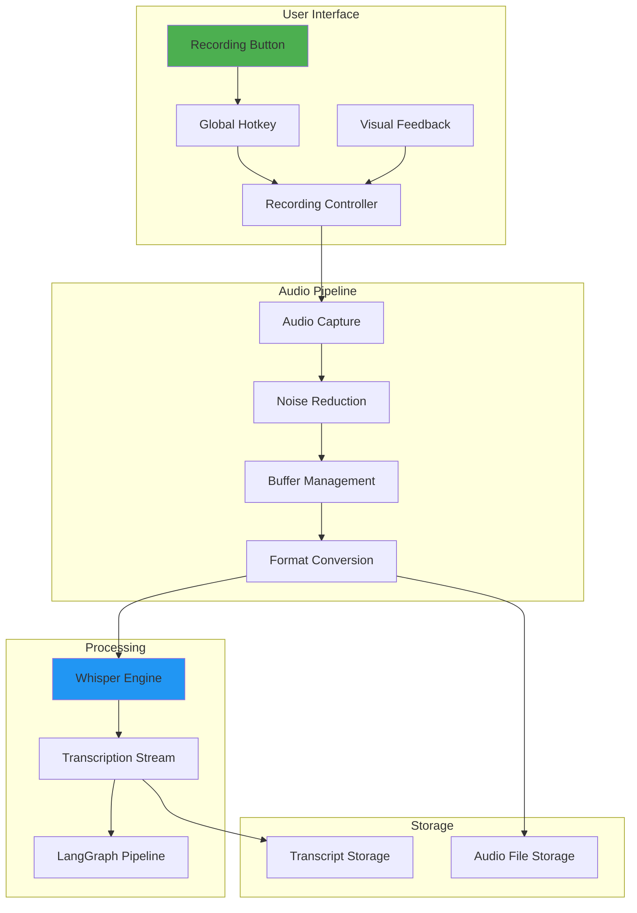
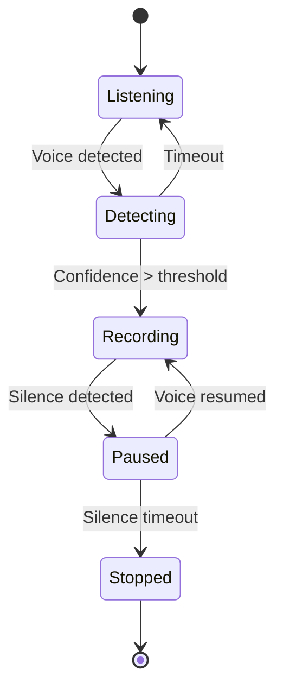
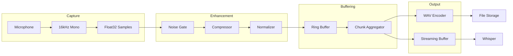
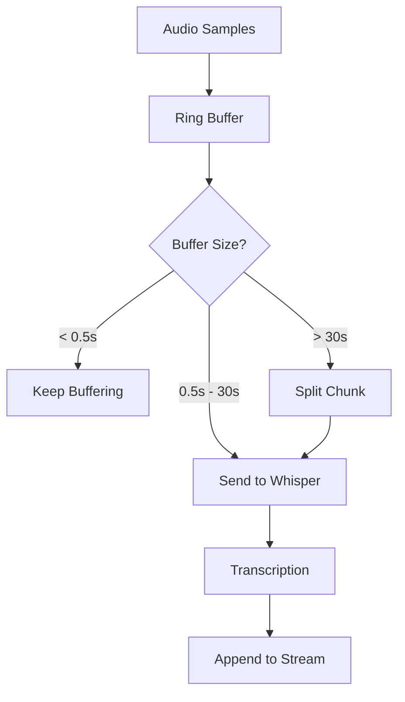
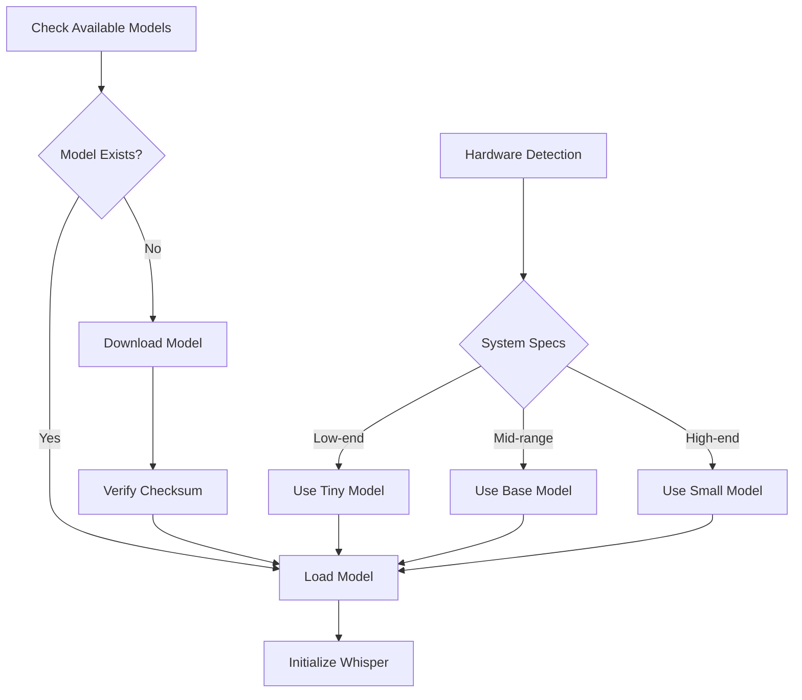
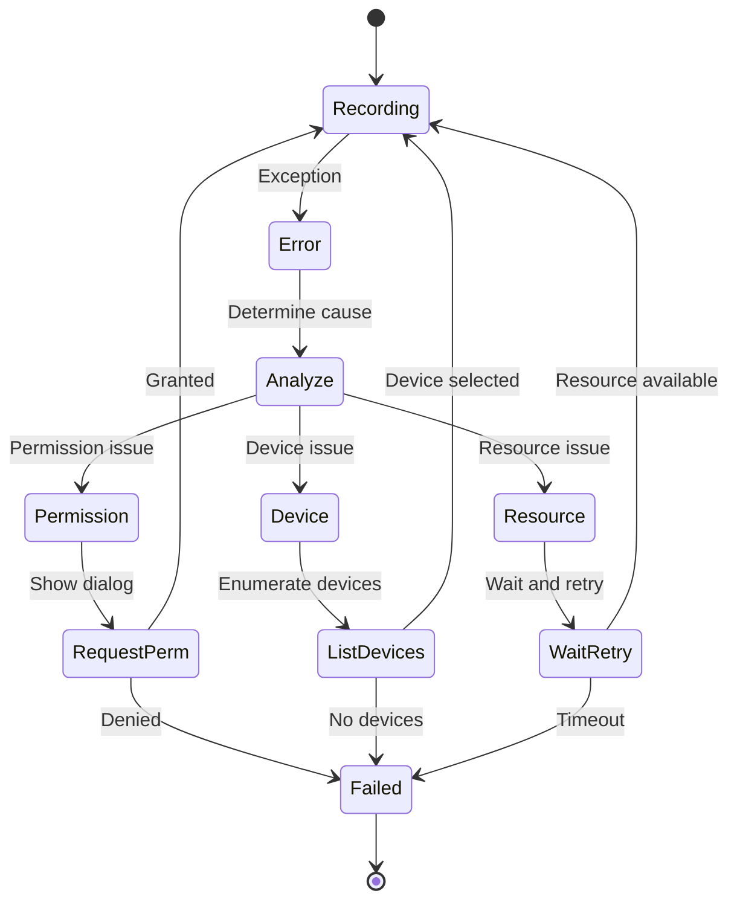

# Aurix - Voice Recording Implementation

## Overview

Aurix's voice recording system provides a seamless, low-latency experience for capturing user thoughts. The implementation supports multiple recording modes, real-time feedback, and efficient audio processing while maintaining privacy through local-only processing.

## Recording Architecture



## Recording Modes

### 1. Push-to-Talk (PTT)
Hold a key/button to record, release to stop.

```typescript
class PushToTalkRecorder {
  private isKeyPressed = false;
  private recordingTimeout?: NodeJS.Timeout;
  
  setupGlobalShortcut() {
    // Register global hotkey (F4 by default)
    globalShortcut.register('F4', () => {
      if (!this.isKeyPressed) {
        this.startRecording();
        this.isKeyPressed = true;
      }
    });
    
    // Use raw key events to detect release
    app.on('browser-window-focus', () => {
      const window = BrowserWindow.getFocusedWindow();
      if (window) {
        window.webContents.on('before-input-event', (event, input) => {
          if (input.key === 'F4' && input.type === 'keyUp') {
            this.stopRecording();
            this.isKeyPressed = false;
          }
        });
      }
    });
  }
}
```

### 2. Click-to-Toggle
Single click to start, click again to stop.

```typescript
class ToggleRecorder {
  private isRecording = false;
  private startTime?: number;
  
  toggle() {
    if (!this.isRecording) {
      this.startRecording();
      this.startTime = Date.now();
    } else {
      const duration = Date.now() - this.startTime!;
      if (duration < 500) {
        // Prevent accidental double-clicks
        return;
      }
      this.stopRecording();
    }
    this.isRecording = !this.isRecording;
  }
}
```

### 3. Voice Activity Detection (VAD)
Automatically start/stop based on speech detection.



## Audio Capture Implementation

### Web Audio API Setup

```typescript
class AudioCapture {
  private audioContext: AudioContext;
  private mediaStream?: MediaStream;
  private source?: MediaStreamAudioSourceNode;
  private processor?: ScriptProcessorNode;
  private worklet?: AudioWorkletNode;
  
  async initialize() {
    // Request microphone access
    this.mediaStream = await navigator.mediaDevices.getUserMedia({
      audio: {
        echoCancellation: true,
        noiseSuppression: true,
        autoGainControl: true,
        sampleRate: 16000, // Optimal for Whisper
        channelCount: 1    // Mono is sufficient
      }
    });
    
    // Create audio context
    this.audioContext = new AudioContext({ sampleRate: 16000 });
    this.source = this.audioContext.createMediaStreamSource(this.mediaStream);
    
    // Use AudioWorklet for better performance
    await this.setupAudioWorklet();
  }
  
  private async setupAudioWorklet() {
    // Load custom processor
    await this.audioContext.audioWorklet.addModule('audio-processor.js');
    
    this.worklet = new AudioWorkletNode(this.audioContext, 'audio-processor', {
      processorOptions: {
        bufferSize: 2048,
        numberOfChannels: 1
      }
    });
    
    // Connect the chain
    this.source!.connect(this.worklet);
    
    // Handle processed audio
    this.worklet.port.onmessage = (event) => {
      this.handleAudioData(event.data);
    };
  }
}
```

### Audio Worklet Processor

```javascript
// audio-processor.js
class AudioProcessor extends AudioWorkletProcessor {
  constructor(options) {
    super();
    this.bufferSize = options.processorOptions.bufferSize;
    this.buffer = new Float32Array(this.bufferSize);
    this.bufferIndex = 0;
  }
  
  process(inputs, outputs, parameters) {
    const input = inputs[0];
    if (!input || !input[0]) return true;
    
    const samples = input[0];
    
    for (let i = 0; i < samples.length; i++) {
      this.buffer[this.bufferIndex++] = samples[i];
      
      if (this.bufferIndex >= this.bufferSize) {
        // Send buffer to main thread
        this.port.postMessage({
          type: 'audio-data',
          buffer: this.buffer.slice(),
          timestamp: currentTime
        });
        
        this.bufferIndex = 0;
      }
    }
    
    return true; // Keep processor alive
  }
}

registerProcessor('audio-processor', AudioProcessor);
```

## Audio Processing Pipeline



### Real-Time Audio Enhancement

```typescript
class AudioEnhancer {
  private noiseGate: NoiseGate;
  private compressor: DynamicsCompressorNode;
  private gain: GainNode;
  
  constructor(context: AudioContext) {
    // Noise gate to remove background noise
    this.noiseGate = new NoiseGate(context, {
      threshold: -50,  // dB
      ratio: 10,
      attack: 0.003,
      release: 0.1
    });
    
    // Compressor for consistent volume
    this.compressor = context.createDynamicsCompressor();
    this.compressor.threshold.value = -20;
    this.compressor.knee.value = 10;
    this.compressor.ratio.value = 4;
    this.compressor.attack.value = 0.003;
    this.compressor.release.value = 0.1;
    
    // Output gain
    this.gain = context.createGain();
    this.gain.gain.value = 1.0;
  }
  
  connect(source: AudioNode, destination: AudioNode) {
    source
      .connect(this.noiseGate.input)
      .connect(this.compressor)
      .connect(this.gain)
      .connect(destination);
  }
}
```

### Voice Activity Detection (VAD)

```typescript
class VoiceActivityDetector {
  private energyThreshold = 0.01;
  private zeroCrossingThreshold = 50;
  private silenceTimeout = 2000; // 2 seconds
  private lastVoiceTime = 0;
  
  detectVoice(samples: Float32Array): boolean {
    const energy = this.calculateEnergy(samples);
    const zeroCrossings = this.calculateZeroCrossings(samples);
    
    // Simple VAD based on energy and zero crossings
    const hasVoice = energy > this.energyThreshold && 
                     zeroCrossings > this.zeroCrossingThreshold;
    
    if (hasVoice) {
      this.lastVoiceTime = Date.now();
    }
    
    return hasVoice;
  }
  
  private calculateEnergy(samples: Float32Array): number {
    let sum = 0;
    for (let i = 0; i < samples.length; i++) {
      sum += samples[i] * samples[i];
    }
    return Math.sqrt(sum / samples.length);
  }
  
  private calculateZeroCrossings(samples: Float32Array): number {
    let crossings = 0;
    for (let i = 1; i < samples.length; i++) {
      if ((samples[i] >= 0) !== (samples[i - 1] >= 0)) {
        crossings++;
      }
    }
    return crossings;
  }
  
  isSilent(): boolean {
    return Date.now() - this.lastVoiceTime > this.silenceTimeout;
  }
}
```

## Buffer Management

### Ring Buffer Implementation

```typescript
class AudioRingBuffer {
  private buffer: Float32Array;
  private writeIndex = 0;
  private readIndex = 0;
  private availableSamples = 0;
  
  constructor(private size: number) {
    this.buffer = new Float32Array(size);
  }
  
  write(samples: Float32Array): boolean {
    if (this.availableSpace() < samples.length) {
      return false; // Buffer full
    }
    
    for (let i = 0; i < samples.length; i++) {
      this.buffer[this.writeIndex] = samples[i];
      this.writeIndex = (this.writeIndex + 1) % this.size;
      this.availableSamples++;
    }
    
    return true;
  }
  
  read(count: number): Float32Array | null {
    if (this.availableSamples < count) {
      return null; // Not enough data
    }
    
    const result = new Float32Array(count);
    for (let i = 0; i < count; i++) {
      result[i] = this.buffer[this.readIndex];
      this.readIndex = (this.readIndex + 1) % this.size;
      this.availableSamples--;
    }
    
    return result;
  }
  
  availableSpace(): number {
    return this.size - this.availableSamples;
  }
}
```

### Chunk Aggregation for Whisper



## WAV File Encoding

```typescript
class WavEncoder {
  static encode(samples: Float32Array, sampleRate: number): ArrayBuffer {
    const length = samples.length;
    const arrayBuffer = new ArrayBuffer(44 + length * 2);
    const view = new DataView(arrayBuffer);
    
    // WAV header
    const writeString = (offset: number, string: string) => {
      for (let i = 0; i < string.length; i++) {
        view.setUint8(offset + i, string.charCodeAt(i));
      }
    };
    
    writeString(0, 'RIFF');
    view.setUint32(4, 36 + length * 2, true); // File size
    writeString(8, 'WAVE');
    writeString(12, 'fmt ');
    view.setUint32(16, 16, true); // Subchunk size
    view.setUint16(20, 1, true); // Audio format (PCM)
    view.setUint16(22, 1, true); // Channels (mono)
    view.setUint32(24, sampleRate, true); // Sample rate
    view.setUint32(28, sampleRate * 2, true); // Byte rate
    view.setUint16(32, 2, true); // Block align
    view.setUint16(34, 16, true); // Bits per sample
    writeString(36, 'data');
    view.setUint32(40, length * 2, true); // Data size
    
    // Convert float samples to 16-bit PCM
    let offset = 44;
    for (let i = 0; i < length; i++) {
      const sample = Math.max(-1, Math.min(1, samples[i]));
      view.setInt16(offset, sample * 0x7FFF, true);
      offset += 2;
    }
    
    return arrayBuffer;
  }
}
```

## Whisper Integration

### Streaming Transcription

```typescript
class WhisperTranscriber {
  private whisperProcess?: ChildProcess;
  private partialTranscript = '';
  private transcriptSubject = new Subject<TranscriptUpdate>();
  
  async initialize() {
    // Use whisper.cpp with streaming mode
    this.whisperProcess = spawn('whisper', [
      '--model', this.getModelPath(),
      '--language', 'en',
      '--threads', '4',
      '--stream',
      '--step', '500',  // Process every 500ms
      '--length', '3000', // 3 second chunks
      '-'  // Read from stdin
    ]);
    
    this.whisperProcess.stdout?.on('data', (data) => {
      this.handleTranscription(data.toString());
    });
  }
  
  async transcribe(audioBuffer: ArrayBuffer) {
    if (!this.whisperProcess) {
      throw new Error('Whisper not initialized');
    }
    
    // Send audio data to whisper process
    this.whisperProcess.stdin?.write(Buffer.from(audioBuffer));
  }
  
  private handleTranscription(text: string) {
    // Parse whisper output
    const lines = text.split('\n').filter(line => line.trim());
    
    for (const line of lines) {
      if (line.startsWith('[')) {
        // Timestamp line, extract transcription
        const match = line.match(/\[[\d:,]+ --> [\d:,]+\]\s+(.*)/);
        if (match) {
          const transcript = match[1].trim();
          
          this.transcriptSubject.next({
            type: 'partial',
            text: transcript,
            timestamp: Date.now()
          });
        }
      }
    }
  }
}
```

### Model Management



```typescript
class WhisperModelManager {
  private modelPath = path.join(app.getPath('userData'), 'models');
  
  async ensureModel(type: ModelType = 'tiny'): Promise<string> {
    const modelFile = `ggml-${type}.bin`;
    const fullPath = path.join(this.modelPath, modelFile);
    
    if (await fs.pathExists(fullPath)) {
      return fullPath;
    }
    
    // Download model
    await this.downloadModel(type);
    return fullPath;
  }
  
  private async downloadModel(type: ModelType) {
    const urls: Record<ModelType, string> = {
      tiny: 'https://huggingface.co/ggerganov/whisper.cpp/resolve/main/ggml-tiny.bin',
      base: 'https://huggingface.co/ggerganov/whisper.cpp/resolve/main/ggml-base.bin',
      small: 'https://huggingface.co/ggerganov/whisper.cpp/resolve/main/ggml-small.bin'
    };
    
    const response = await fetch(urls[type]);
    const buffer = await response.arrayBuffer();
    
    // Verify checksum
    const hash = crypto.createHash('sha256').update(Buffer.from(buffer)).digest('hex');
    if (hash !== EXPECTED_HASHES[type]) {
      throw new Error('Model checksum mismatch');
    }
    
    await fs.writeFile(path.join(this.modelPath, `ggml-${type}.bin`), Buffer.from(buffer));
  }
  
  selectOptimalModel(): ModelType {
    const memory = os.totalmem();
    const cpus = os.cpus().length;
    
    if (memory > 16 * 1024 * 1024 * 1024 && cpus >= 8) {
      return 'small';
    } else if (memory > 8 * 1024 * 1024 * 1024 && cpus >= 4) {
      return 'base';
    }
    return 'tiny';
  }
}
```

## Platform-Specific Implementations

### macOS Optimizations

```typescript
class MacOSAudioHandler {
  async requestPermissions() {
    const { systemPreferences } = require('electron');
    
    const microphoneStatus = systemPreferences.getMediaAccessStatus('microphone');
    if (microphoneStatus !== 'granted') {
      await systemPreferences.askForMediaAccess('microphone');
    }
  }
  
  setupAudioSession() {
    // Use CoreAudio for better performance on macOS
    if (process.platform === 'darwin') {
      // Set audio session category for recording
      app.commandLine.appendSwitch('audio-session-category', 'record');
      
      // Enable hardware acceleration for Metal-enabled Macs
      app.commandLine.appendSwitch('enable-features', 'Metal');
    }
  }
}
```

### Windows Audio Session

```typescript
class WindowsAudioHandler {
  setupWASAPI() {
    if (process.platform === 'win32') {
      // Use WASAPI for lower latency on Windows
      app.commandLine.appendSwitch('audio-backend', 'wasapi');
      
      // Set process priority for better audio performance
      const { exec } = require('child_process');
      exec(`wmic process where "name='${app.getName()}.exe'" call setpriority "high priority"`);
    }
  }
}
```

### Linux ALSA/PulseAudio

```typescript
class LinuxAudioHandler {
  async detectAudioSystem(): Promise<'alsa' | 'pulse' | 'pipewire'> {
    try {
      await exec('pactl info');
      return 'pulse';
    } catch {
      try {
        await exec('pipewire --version');
        return 'pipewire';
      } catch {
        return 'alsa';
      }
    }
  }
}
```

## Error Handling and Recovery

### Common Audio Errors

```typescript
class AudioErrorHandler {
  async handleError(error: Error): Promise<RecoveryAction> {
    if (error.name === 'NotAllowedError') {
      // Microphone permission denied
      return {
        action: 'request-permission',
        message: 'Microphone access required for voice recording'
      };
    }
    
    if (error.name === 'NotFoundError') {
      // No microphone found
      return {
        action: 'show-settings',
        message: 'No microphone detected. Please connect a microphone.'
      };
    }
    
    if (error.name === 'NotReadableError') {
      // Microphone in use by another app
      return {
        action: 'retry-delayed',
        message: 'Microphone is being used by another application'
      };
    }
    
    // Default fallback
    return {
      action: 'show-error',
      message: 'An error occurred during audio recording'
    };
  }
}
```

### Recovery Strategies



## Performance Monitoring

### Audio Pipeline Metrics

```typescript
interface AudioMetrics {
  captureLatency: number;
  processingLatency: number;
  transcriptionLatency: number;
  dropoutCount: number;
  bufferUnderrunCount: number;
  cpuUsage: number;
  memoryUsage: number;
}

class AudioPerformanceMonitor {
  private metrics: AudioMetrics = {
    captureLatency: 0,
    processingLatency: 0,
    transcriptionLatency: 0,
    dropoutCount: 0,
    bufferUnderrunCount: 0,
    cpuUsage: 0,
    memoryUsage: 0
  };
  
  private metricsInterval?: NodeJS.Timer;
  
  start() {
    this.metricsInterval = setInterval(() => {
      this.updateMetrics();
      this.checkPerformance();
    }, 1000);
  }
  
  private checkPerformance() {
    if (this.metrics.captureLatency > 50) {
      console.warn('High capture latency detected:', this.metrics.captureLatency);
    }
    
    if (this.metrics.dropoutCount > 0) {
      console.error('Audio dropouts detected:', this.metrics.dropoutCount);
      this.optimizePerformance();
    }
  }
  
  private optimizePerformance() {
    // Lower sample rate if needed
    // Increase buffer size
    // Reduce processing complexity
  }
}
```

## User Interface Integration

### Recording Status Indicator

```typescript
class RecordingUI {
  private statusElement: HTMLElement;
  private waveformCanvas: HTMLCanvasElement;
  private animationFrame?: number;
  
  updateStatus(state: RecordingState) {
    switch (state) {
      case 'idle':
        this.statusElement.className = 'recording-idle';
        this.statusElement.textContent = 'Click to record';
        break;
        
      case 'recording':
        this.statusElement.className = 'recording-active';
        this.statusElement.textContent = 'Recording...';
        this.startWaveformAnimation();
        break;
        
      case 'processing':
        this.statusElement.className = 'recording-processing';
        this.statusElement.textContent = 'Processing...';
        break;
    }
  }
  
  private startWaveformAnimation() {
    const ctx = this.waveformCanvas.getContext('2d')!;
    const width = this.waveformCanvas.width;
    const height = this.waveformCanvas.height;
    
    const animate = () => {
      ctx.clearRect(0, 0, width, height);
      
      // Draw waveform from audio data
      ctx.beginPath();
      ctx.strokeStyle = '#4CAF50';
      ctx.lineWidth = 2;
      
      for (let i = 0; i < this.audioSamples.length; i++) {
        const x = (i / this.audioSamples.length) * width;
        const y = (1 + this.audioSamples[i]) * height / 2;
        
        if (i === 0) {
          ctx.moveTo(x, y);
        } else {
          ctx.lineTo(x, y);
        }
      }
      
      ctx.stroke();
      
      this.animationFrame = requestAnimationFrame(animate);
    };
    
    animate();
  }
}
```

### Keyboard Shortcuts

```typescript
class KeyboardShortcuts {
  private shortcuts: Map<string, () => void> = new Map();
  
  register() {
    // Primary recording shortcut
    this.shortcuts.set('F4', () => this.toggleRecording());
    
    // Alternative shortcuts
    this.shortcuts.set('CommandOrControl+Shift+R', () => this.toggleRecording());
    this.shortcuts.set('CommandOrControl+Shift+S', () => this.stopRecording());
    this.shortcuts.set('CommandOrControl+Shift+P', () => this.pauseRecording());
    
    // Register with Electron
    this.shortcuts.forEach((handler, key) => {
      globalShortcut.register(key, handler);
    });
  }
  
  customizeShortcut(action: string, newKey: string) {
    // Allow users to customize shortcuts
    const oldKey = Array.from(this.shortcuts.entries())
      .find(([_, handler]) => handler.name === action)?.[0];
    
    if (oldKey) {
      globalShortcut.unregister(oldKey);
      this.shortcuts.delete(oldKey);
    }
    
    this.shortcuts.set(newKey, this[action]);
    globalShortcut.register(newKey, this[action]);
  }
}
```

## Testing Strategy

### Audio Recording Tests

```typescript
describe('Audio Recording', () => {
  let recorder: AudioRecorder;
  
  beforeEach(() => {
    recorder = new AudioRecorder();
  });
  
  test('should initialize audio context', async () => {
    await recorder.initialize();
    expect(recorder.audioContext).toBeDefined();
    expect(recorder.audioContext.sampleRate).toBe(16000);
  });
  
  test('should handle permission denial gracefully', async () => {
    // Mock permission denial
    navigator.mediaDevices.getUserMedia = jest.fn()
      .mockRejectedValue(new DOMException('Permission denied', 'NotAllowedError'));
    
    await expect(recorder.initialize()).rejects.toThrow('Permission denied');
  });
  
  test('should detect voice activity', () => {
    const vad = new VoiceActivityDetector();
    
    // Test with silence
    const silence = new Float32Array(1024).fill(0);
    expect(vad.detectVoice(silence)).toBe(false);
    
    // Test with voice
    const voice = new Float32Array(1024);
    for (let i = 0; i < voice.length; i++) {
      voice[i] = Math.sin(2 * Math.PI * 440 * i / 16000) * 0.5;
    }
    expect(vad.detectVoice(voice)).toBe(true);
  });
});
```

## Conclusion

Aurix's voice recording implementation provides a robust, low-latency solution for capturing user thoughts. Key features include:

- **Multiple Recording Modes**: Push-to-talk, toggle, and voice-activated
- **Real-Time Processing**: Streaming transcription with minimal latency
- **Cross-Platform**: Optimized for Windows, macOS, and Linux
- **Privacy-First**: All processing happens locally
- **Error Resilient**: Comprehensive error handling and recovery

The architecture ensures that users can effortlessly capture their ideas without technical barriers, maintaining Aurix's promise of frictionless documentation.