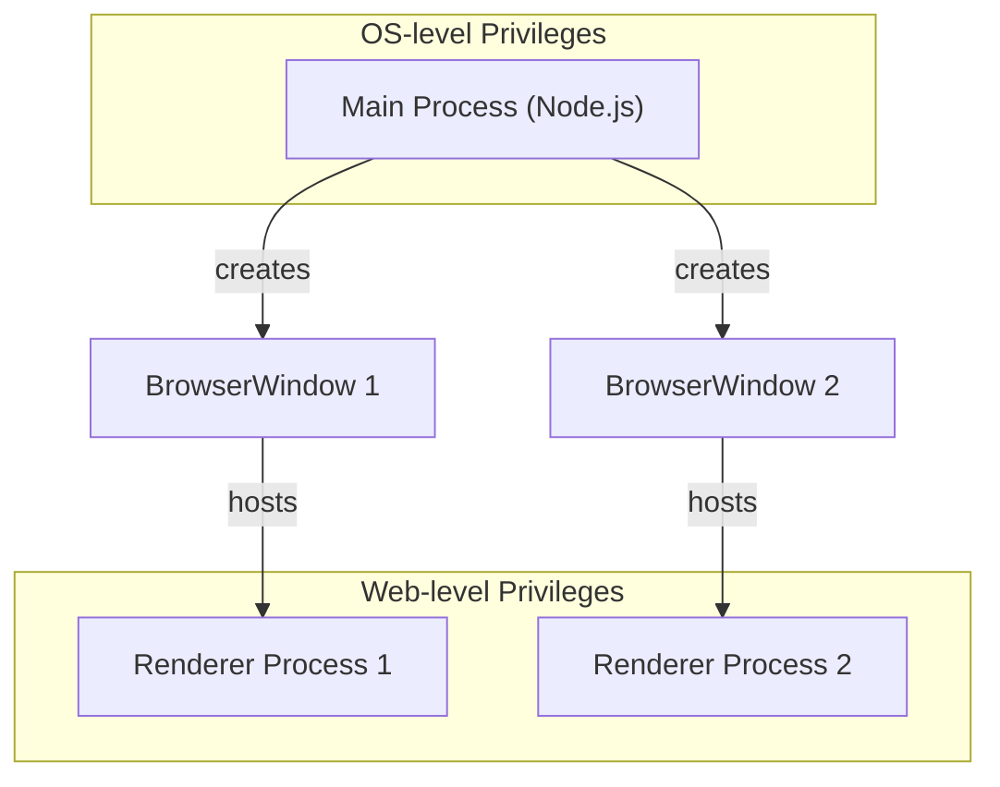
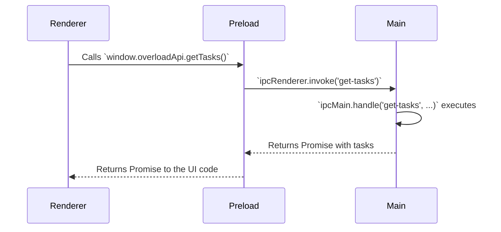

# Electron Best Practices for Overload

Building a secure, robust, and maintainable Electron application requires adhering to a set of core principles. This guide outlines the essential best practices adopted by the Overload project, based on official Electron recommendations. Following these guidelines is critical for protecting users and creating a high-quality application.

## 1. Understand the Process Model

Electron's architecture is based on Chromium's multi-process model, which is fundamental to how Overload operates.

- **Main Process**: There is only one main process. It's the application's entry point and runs in a full Node.js environment. Its primary responsibilities are managing application lifecycle, creating and managing windows (`BrowserWindow`), and handling native OS integrations (like menus and dialogs). It is the only process with direct access to all of Electron's APIs and Node.js.

- **Renderer Processes**: Each window in Overload runs its own renderer process. The renderer is responsible only for displaying web content (your HTML, CSS, and JS). It runs in a standard web environment and **does not** have direct access to Node.js or Electron's native APIs. All UI for Overload is built within a renderer process.



## 2. Enforce Context Isolation & Use `contextBridge`

This is one of the most important security features in Electron. Context Isolation ensures that the code in your preload script and the code in the renderer (the website content) run in separate JavaScript contexts.

- **Always Enabled**: Context Isolation is enabled by default in Overload and must not be disabled.
- **No Direct `window` Manipulation**: You cannot share objects directly from a preload script to the renderer by attaching them to `window` (e.g., `window.myApi = ...`). This is insecure and will not work with context isolation.
- **Use `contextBridge`**: The only secure way to expose APIs from your preload script to the renderer is via the `contextBridge.exposeInMainWorld` method.

### Example: Exposing an API for Overload

```typescript
// preload.ts

import { contextBridge, ipcRenderer } from 'electron';

// Define the API you want to expose
export const overloadApi = {
  getOverloadIndex: () => ipcRenderer.invoke('get-overload-index'),
  getTasks: (date: string) => ipcRenderer.invoke('get-tasks', date),
};

// Securely expose the API to the renderer process
contextBridge.exposeInMainWorld('overloadApi', overloadApi);
```

```typescript
// renderer.ts

// Now you can safely access the API in your UI code
async function displayTasks() {
  const tasks = await window.overloadApi.getTasks('2025-07-01');
  console.log(tasks);
}
```

## 3. Use Asynchronous, Promise-Based IPC

Communication between the main and renderer processes is essential. The recommended pattern is to use `ipcRenderer.invoke()` with `ipcMain.handle()`.

- **Renderer-to-Main (Invoke/Handle)**: This pattern is asynchronous and promise-based, making it ideal for requesting data or triggering an action in the main process and getting a response.
- **Avoid `ipcRenderer.send`**: While `send` can be used for one-way communication, be cautious. Never expose it directly via the context bridge. Instead, wrap it in a function that validates and sanitizes arguments.
- **Never Use `sendSync`**: Synchronous IPC blocks the renderer process, leading to a poor user experience. It should be avoided.

### Example: Secure IPC Flow



## 4. Sandbox All Renderer Processes

For maximum security, all renderers in Overload must be sandboxed. A sandboxed renderer has its privileges drastically restricted, which significantly limits the damage a potential vulnerability (e.g., an XSS attack) can cause.

- **Enabled by Default**: The Electron Vite template enables this by default (`webPreferences: { sandbox: true }`).
- **Limited Access**: In a sandboxed renderer, the preload script has very limited Node.js access. It can use a subset of Node APIs like `Buffer`, `Promise`, etc., but cannot import arbitrary modules like `fs`.
- **Preload Scripts are Key**: The preload script becomes even more critical in a sandboxed environment, as it's the only bridge to the more privileged main process via IPC.

## 5. Consider MessagePorts for Complex Scenarios

For direct communication that doesn't need to go through the main process (e.g., renderer-to-renderer or renderer-to-utility-process), `MessageChannel` provides a high-performance alternative to IPC.

- **Direct Channel**: It creates a direct, two-way communication channel between two contexts.
- **Performance**: It is more performant than sending messages via the main process, which acts as a middleman in standard IPC.

This is an advanced pattern but is the best practice for performance-critical communication between multiple windows or background utility processes. 