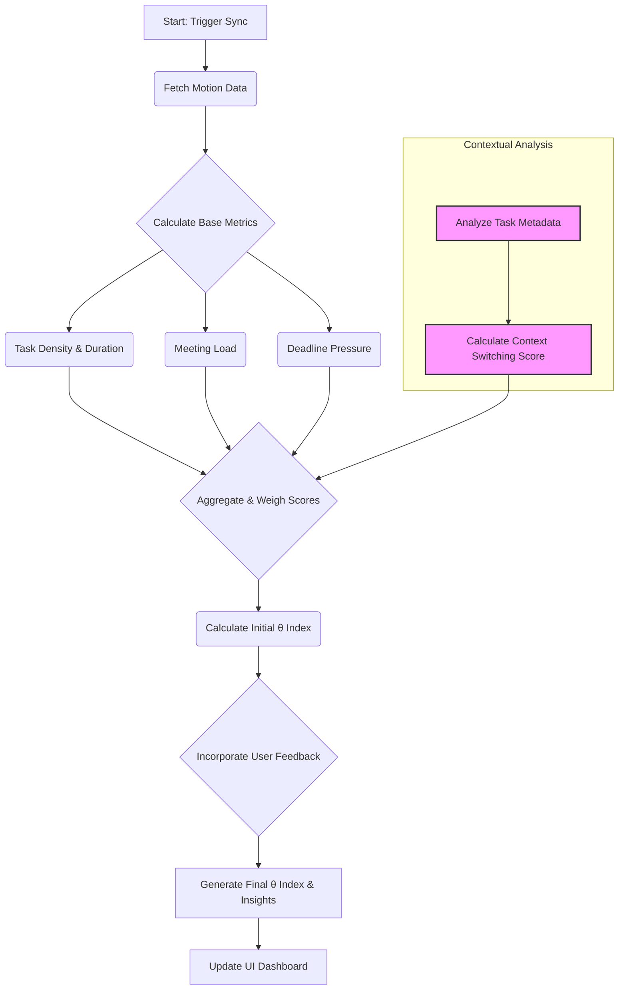

# BrainLift: Architecting Intelligent Workload Awareness

This document serves as the "BrainLift" for the Overload project. It details the process of learning, understanding, and designing the AI-powered workflows that form the core of the application. It's the story of how we moved from a problem to an intelligent, adaptive solution.

## 1. The Problem: Beyond a Packed Calendar

Productivity tools are excellent at managing time, but they are notoriously poor at managing *capacity*. My personal frustration, and the problem Overload is built to solve, is the disconnect between a perfectly scheduled day and the feeling of being completely overwhelmed. A day with ten 30-minute tasks looks manageable on a calendar, but it fails to account for the cognitive cost of context switching, the hidden complexity in tasks, and the looming pressure of deadlines.

The core issue is that traditional tools lack **workload awareness**. They can tell you *what* you're supposed to be doing, but not *how much* you're actually taking on. This is where the opportunity for an intelligent desktop application lies.

## 2. The Core Concept: The "Overload Index (θ)"

The solution isn't just about better scheduling; it's about quantifying workload in a personalized way. This led to the concept of the **Overload Index (θ)**, a single, personalized score that represents your current cognitive load.

To make this concept a reality, I first had to understand the data sources. The [Motion API Best Practices](./best-practices/motion.md) document was the result of this initial learning phase. It outlines how to responsibly fetch and cache data, but more importantly, it details what data points are crucial for calculating θ:
- **Task Density**: The number of tasks scheduled in a given period.
- **Time Pressure**: The ratio of scheduled work to available time.
- **Deadline Proximity**: The urgency driven by approaching deadlines.
- **Context Switching**: The frequency of shifts between different projects or work types, which we can infer from task metadata.
- **Task Complexity**: Inferred from keywords, descriptions, and user-provided tags (`effort:high`, etc.).

## 3. The Tool for the Job: Why LangGraph?

Calculating θ is not a simple, one-step process. It's a multi-stage workflow that involves fetching data, calculating base metrics, analyzing context, and generating insights. This is a perfect use case for an AI workflow orchestrator.

As outlined in the [Project Scope](./scope.md), **LangGraph** was chosen for several key reasons:
1.  **State Management**: It allows us to maintain a persistent state object that carries information through the workflow, from raw data to the final calculated index.
2.  **Modularity**: Each step in the calculation can be a distinct "node" in the graph. This makes the logic easy to understand, test, and modify. We can swap out a calculation model or add a new data source without rewriting the entire workflow.
3.  **Cycles and Adaptation**: LangGraph's ability to create cycles is crucial for the feedback loop. The user's feedback can trigger a re-evaluation of the graph, allowing the system to learn and adapt over time.

This workflow runs locally within the Electron application, leveraging the desktop environment's ability to execute persistent background processes without relying on a cloud server for the core logic.

## 4. The Workflow Architecture: From Data to Insight

The Overload Index workflow is designed as a directed acyclic graph (with the potential for cycles based on user feedback). A detailed technical breakdown is available in the [AI Workflow Architecture](./ai-workflow.md) document, but the high-level flow is as follows:

This graph takes raw task data and transforms it into a meaningful, actionable insight that is then displayed to the user, as envisioned in the [User Journey](./user-journey.md).

## 5. Enhancement & Future Direction: A Learning System

The most powerful aspect of this architecture is its capacity for enhancement. The user feedback slider ("How overloaded do you feel?") is not just a UI element; it's the entry point to the system's learning loop. This feedback is stored and used to adjust the weighting of different factors in the θ calculation over time, making the index truly personalized.

This project is not just about building a static tool, but about creating an intelligent assistant that grows with the user. The foundation laid here allows for future enhancements like integrating more data sources (e.g., local file activity, biometric data) or swapping in more advanced local LLMs to provide even richer, more proactive insights into personal productivity.
