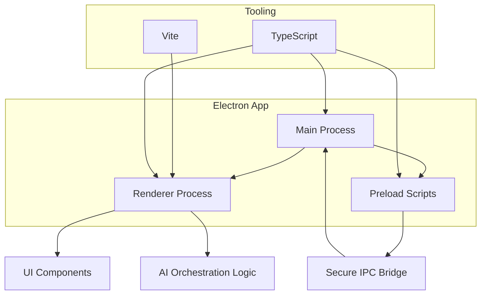
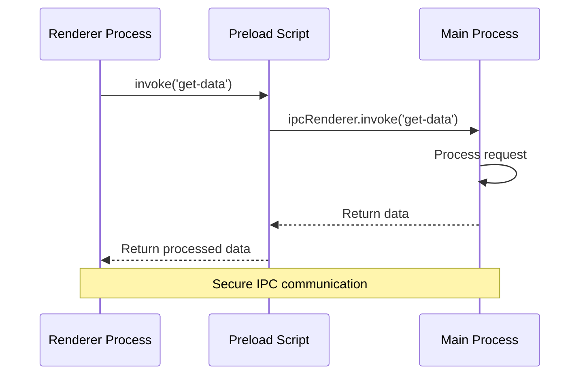

# Welcome to Overload

Welcome to the official documentation for **Overload** — your AI-powered workload awareness assistant.

Overload is a local-first, Electron-based desktop application designed to help you understand and manage your personal workload before you hit burnout. It analyzes your scheduled tasks, meetings, and behavior patterns to calculate a personalized **Overload Index (θ)** — giving you real-time insight into when you're taking on too much.

Built with modern web technologies and intelligent workflow orchestration, Overload doesn't just help you work harder — it helps you work smarter.

---

## What is Overload?

**Overload** is a desktop productivity tool that connects to your scheduling systems (like [Motion](https://usemotion.com)), monitors your daily workload, and provides AI-powered guidance to:

* Detect when you're overcommitted
* Visualize workload trends over time
* Recommend task deferrals, re-prioritization, or rest periods
* Learn and adapt based on your feedback

Unlike calendar tools that only optimize time, Overload measures your actual cognitive and task load, using AI to make your schedule *sustainable* — not just efficient.

---

## Technology Stack

Overload is built using a modern, fast, and developer-friendly tech stack:

* **Electron Forge** – Native desktop shell and build pipeline
* **TypeScript** – For type-safe application development
* **Vite** – For lightning-fast bundling and hot module reloading
* **LangGraph** (or N8N) – For intelligent local automation workflows
* **OpenAI / Local LLMs** – For AI-assisted reasoning and suggestions

---

## Architecture Overview

The application follows a clean modular architecture with clear separation between the renderer, preload bridge, and main process:



---

## Getting Started (Dev Setup)

### Prerequisites

* [Node.js](https://nodejs.org/en/download/) v18+
* npm (or yarn)

### Local Development

Clone and install dependencies:

```bash
npm install
```

Start the development environment:

```bash
npm run start
```

### Production Build

To package the app for production:

```bash
npm run make
```

---

## Documentation Highlights

This site is built with **Docusaurus** and includes:

* Mermaid Diagrams for architecture & workflows
* Code highlighting for quick copy-paste
* Search, responsive layout, and dark mode toggle

---

## Example: IPC Communication Flow



---

## Next Steps

Ready to dive in? Use the sidebar to explore setup instructions, architecture details, component references, and AI workflow integration.

Welcome to **Overload** — finally know when enough is enough.
