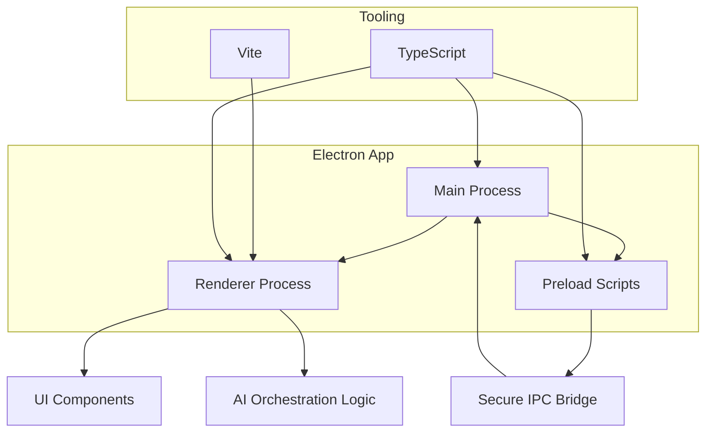
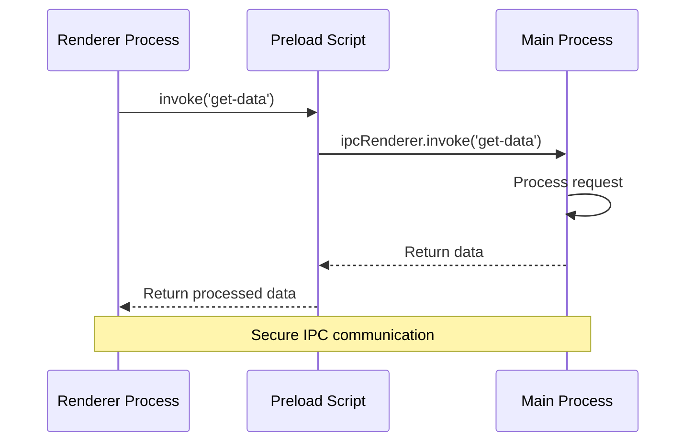

# Welcome to Aurix

## From Cognitive Load to Creative Flow

### The Problem: Great Ideas Die in Silence

Every day, brilliant ideas vanish. You're deep in a coding session, on a walk, or in a meeting when inspiration strikes. You map out a system architecture, a product feature, or an elegant solution in your head. But by the time you sit down to document it, the friction of writing—the context switch, the blank page, the structure—has caused the magic to fade.

**We lose our best thinking to the gap between ideation and documentation.** This is the ultimate form of cognitive overload: the pressure of holding complex thoughts in your head without a seamless way to offload them.

### Enter Aurix: Think Out Loud, Document Automatically

**Aurix** is a local-first desktop application that transforms your spoken thoughts into structured, professional documentation. It's designed to eliminate the friction between your ideas and the written word, turning your voice into your most powerful productivity tool.

**Just speak. Aurix handles the rest.**

### How It Works

1.  **Natural Voice Capture**: Push a button and start talking. Describe your system, walk through your logic, or brainstorm out loud. Aurix captures every word with private, local transcription.
2.  **Intelligent Processing**: Using an advanced LangGraph workflow, Aurix understands not just *what* you said, but *what you meant*. It identifies concepts, relationships, and structure in your speech.
3.  **Automatic Documentation**: Watch as your voice transforms into:
    -   Structured markdown documents with headings and sections.
    -   Mermaid diagrams (flowcharts, sequence diagrams, etc.) generated from your descriptions.
    -   Technical specifications with consistent formatting.
    -   Meeting notes with action items automatically extracted.
4.  **The Cognitive Load Index (θ)**: Beyond documentation, Aurix analyzes the complexity and density of your spoken thoughts to calculate a real-time **Cognitive Load Index**. This unique metric helps you understand when your cognitive load is peaking, providing insight into your most creative and demanding periods.

### Why Desktop?

True productivity and privacy require a dedicated environment. Aurix runs entirely on your machine, ensuring:
-   **Complete Privacy**: Your voice and ideas never leave your computer.
-   **Offline Operation**: Document anywhere, anytime.
-   **Peak Performance**: Direct hardware access for local AI models.
-   **OS Integration**: Global hotkeys, system notifications, and deep workflow integration.

### The Vision

Imagine a world where documentation writes itself, where the gap between thinking and recording disappears. That's the world Aurix is building—one voice at a time.

---

## What is Aurix?

**Aurix** is a desktop productivity tool that connects to your scheduling systems (like [Motion](https://usemotion.com)), monitors your daily workload, and provides AI-powered guidance to:

* Detect when you're overcommitted
* Visualize workload trends over time
* Recommend task deferrals, re-prioritization, or rest periods
* Learn and adapt based on your feedback

Unlike calendar tools that only optimize time, Aurix measures your actual cognitive and task load, using AI to make your schedule *sustainable* — not just efficient.

---

## Technology Stack

Aurix is built using a modern, fast, and developer-friendly tech stack:

* **Electron Forge** – Native desktop shell and build pipeline
* **TypeScript** – For type-safe application development
* **Vite** – For lightning-fast bundling and hot module reloading
* **LangGraph** (or N8N) – For intelligent local automation workflows
* **OpenAI / Local LLMs** – For AI-assisted reasoning and suggestions

---

## Architecture Overview

The application follows a clean modular architecture with clear separation between the renderer, preload bridge, and main process:



---

## Getting Started (Dev Setup)

### Prerequisites

* [Node.js](https://nodejs.org/en/download/) v18+
* npm (or yarn)

### Local Development

Clone and install dependencies:

```bash
npm install
```

Start the development environment:

```bash
npm run start
```

### Production Build

To package the app for production:

```bash
npm run make
```

---

## Documentation Highlights

This site is built with **Docusaurus** and includes:

* Mermaid Diagrams for architecture & workflows
* Code highlighting for quick copy-paste
* Search, responsive layout, and dark mode toggle

---

## Example: IPC Communication Flow



---

## Next Steps

Ready to dive in? Use the sidebar to explore setup instructions, architecture details, component references, and AI workflow integration.

Welcome to **Aurix** — finally know when enough is enough.
