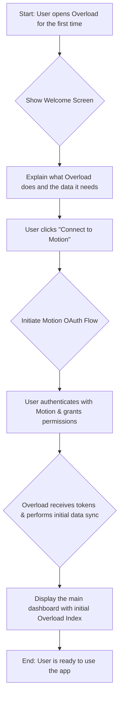
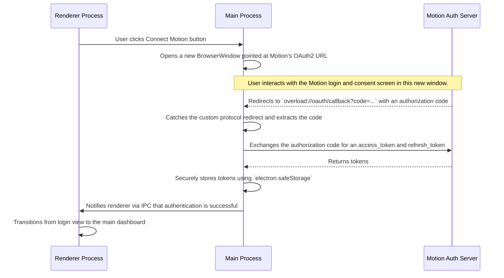
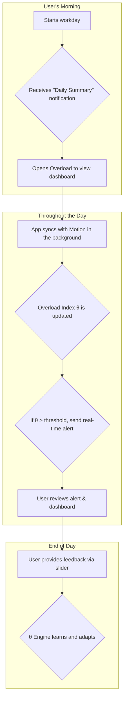

# The Overload User Journey

This document outlines the end-to-end experience for a user of the Overload application, from initial setup to daily interaction and long-term adaptation.

## 1. First-Time Onboarding & Authentication

The user's first interaction is designed to be simple, secure, and transparent, establishing trust and setting clear expectations.

### Onboarding Flow

When the user clicks "Connect to Motion," they are guided through a standard, secure OAuth2 flow. Overload only requests the permissions necessary to analyze tasks and schedules, as outlined in the `scope.md` document.

### Authentication Sequence Diagram

The authentication process is handled securely between the Electron main process and the Motion API, ensuring that the renderer process is never exposed to sensitive credentials.

## 2. The Core Loop: Daily Interaction

Once set up, Overload becomes a daily companion for workload management. The core interaction loop is passive, providing insights with minimal user effort.

### Daily Usage Flow

The user's primary interaction is with the dashboard, which serves as the central hub for understanding their current and historical workload. The application's background sync and proactive notifications mean the user doesn't need to constantly check the app; it informs them when it matters most.

## 3. Understanding Your Workload: The Dashboard

The dashboard is the heart of Overload, providing multi-layered insights into the user's workload.

1.  **The Overload Index (θ) Meter**: An immediate, color-coded gauge showing the current workload percentage against the user's calculated threshold. A reading over 100% indicates a state of overload.
2.  **The Timeline Trend Graph**: Visualizes the θ index over the past week or month, helping the user identify patterns, such as consistently overloaded Wednesdays or periods of sustained high effort.
3.  **Breakdown Cards**: These cards answer the "why" behind the current index. They show the primary contributors to the score, broken down by categories like:
    *   **Task Load**: The sheer volume and complexity of scheduled tasks.
    *   **Meeting Density**: The percentage of the day blocked out for meetings.
    *   **Context Switching**: The frequency of shifts between different projects or types of work.
4.  **Task Insight Panel**: This list highlights the specific tasks or meetings that are contributing most heavily to the current Overload Index, allowing the user to quickly identify what could be deferred or re-prioritized.

## 4. Closing the Loop: Feedback & Personalization

A key feature of Overload is its ability to learn and adapt to the individual.

-   **The Feedback Slider**: At any time, the user can adjust a simple slider to answer the question: *"How overloaded do you feel right now?"*
-   **Reinforcement Learning**: This user-provided feedback is fed back into the θ engine. If a user reports feeling highly overloaded when their index is only 70%, the system learns to adjust its sensitivity for that user. Conversely, if a user feels fine at 110%, the engine learns that they have a higher capacity for that specific type of workload.

This feedback loop ensures that the Overload Index becomes a truly personalized and accurate reflection of the user's unique work patterns and capacity over time.
