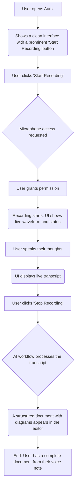
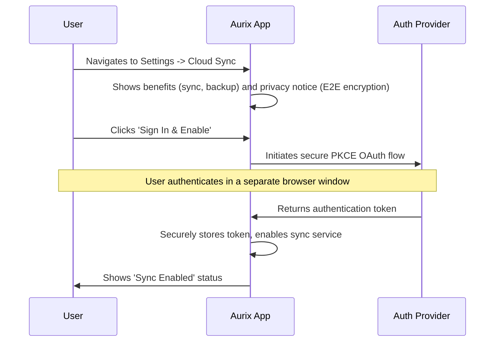

# The Aurix User Journey

This document outlines the end-to-end experience for a user of Aurix, focusing on the voice-first workflow.

## 1. First-Time Experience: Zero to Document in 60 Seconds

The user's first interaction is designed to be immediate and rewarding. There are no mandatory sign-ups or complex configurations.

## 2. The Core Loop: From Thought to Document

The primary interaction is designed to be as frictionless as possible.

1.  **Capture**: The user clicks the record button or uses a global hotkey. The app immediately starts listening.
2.  **Speak**: The user describes a system, brainstorms ideas, or dictates meeting notes.
3.  **Transcribe**: As the user speaks, a live transcript appears in the UI, powered by a local Whisper model. This provides immediate feedback that the system is hearing them correctly.
4.  **Process**: When the user stops recording, the LangGraph workflow is triggered in the background. The UI shows a subtle "Processing..." state.
5.  **Generate**: Within seconds, the raw transcript is replaced by a fully formatted Markdown document. The AI has automatically added headings, lists, bolded key terms, and even generated Mermaid diagrams based on the user's descriptions.
6.  **Refine**: The user can then edit the generated document directly, or simply start a new recording to add more to it.

## 3. Understanding Cognitive Load: The Cognitive Load Index (θ)

After each session, the Cognitive Load Index is calculated and displayed.

-   **Post-Session Insight**: Alongside the generated document, the user sees a score (e.g., "Cognitive Load: 78").
-   **Contextual Breakdown**: Hovering over the score reveals *why* it was rated that way (e.g., "High complexity, technical jargon detected, 2 diagrams generated").
-   **Historical Trends**: A separate dashboard allows the user to see their Cognitive Load Index over time, helping them identify which kinds of thinking or topics are most cognitively demanding.
-   **Feedback Loop**: A simple slider asks, "How taxing was that session?" This feedback helps personalize the θ calculation for the future, making it more attuned to the individual user.

## 4. Optional Cloud Features: Sync & Backup

While the core experience is entirely local, the user can choose to enable cloud features.

This model ensures that user data remains private by default, with cloud services acting as an optional enhancement rather than a requirement.
